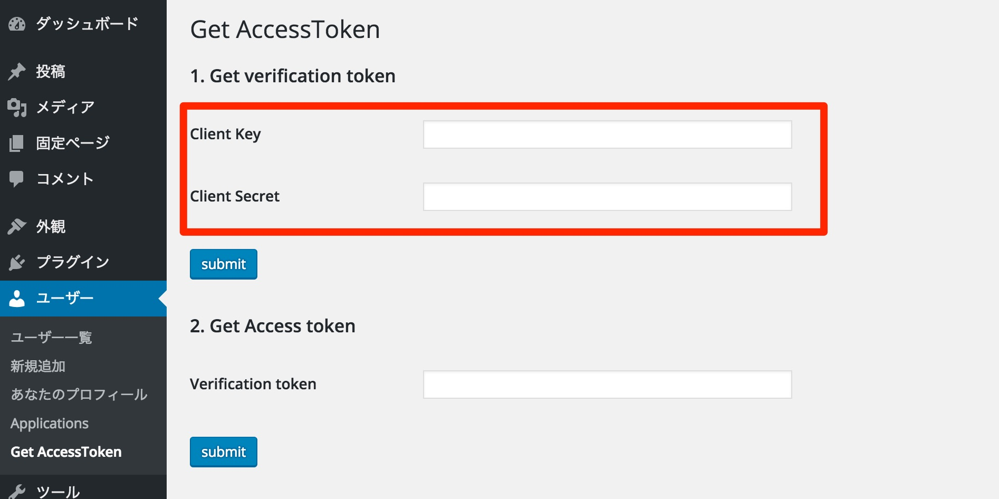
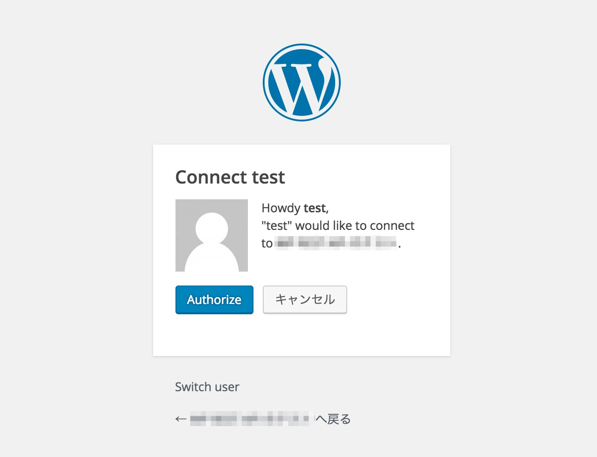
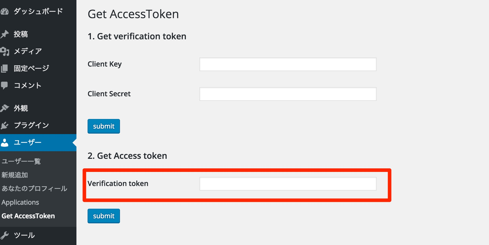
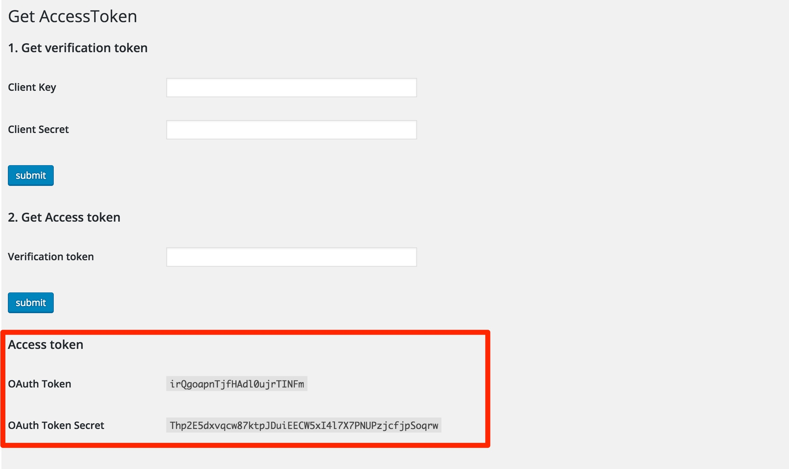

# OAuth1 Get Accesstoken

WP REST API認証時に使用する、OAuth1.0aのアクセストークンを取得するためのプラグイン

##これは何
WP REST API(v2.0)で新規投稿・更新する際には認証が必要となります。  
その認証の1つ、OAuth認証で使用するアクセストークンを生成・表示するためのプラグインです。

##インストール
###前提
使用するためには以下のライブラリ、プラグインが必要です。

* [PERA OAuthライブラリ](https://pear.php.net/package/HTTP_OAuth)
* [プラグイン - WordPress REST API (Version 2) ](https://wordpress.org/plugins/rest-api/)
* [プラグイン - WP REST API - OAuth 1.0a Server](https://github.com/WP-API/OAuth1)

###インストール

1. このリポジトリをzipでダウンロードします
2. WordPressのプラグイン画面から、新規追加をクリックします
3. `プラグインのアップロード`から1でダウンロードしたzipを選択します
4. 自動で展開されインストールされます
5. 有効化します

##使い方
`WP REST API - OAuth 1.0a Server`のプラグインを利用し、新規にアプリケーションを作成します。  
作成したアプリケーションのKeyとSecretを、追加した、`Get AccessToken`の設定画面から入力します。  

直下のSubmitで送信すると、アプリケーションを承認するページヘ遷移します。

Authorizeをクリックすると、`verification token`が表示されるので、コピーするなどしてメモしておきます。

コピーした`verification token`を、`Get AccessToken`の設定画面から入力します。

直下のSubmit(二つ目)で送信すると、アクセストークンが表示されます。

詳しくは以下の記事を参考にしてください。  
[WP REST APIのOAuth1.0a認証用のアクセストークン取得プラグインを作った](http://mrlittlebig.com/blog/post-1111/)

##ライセンス
[GPLv2+](http://www.gnu.org/licenses/gpl-2.0.html)